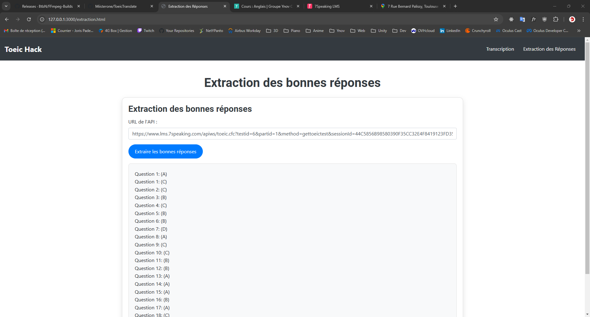
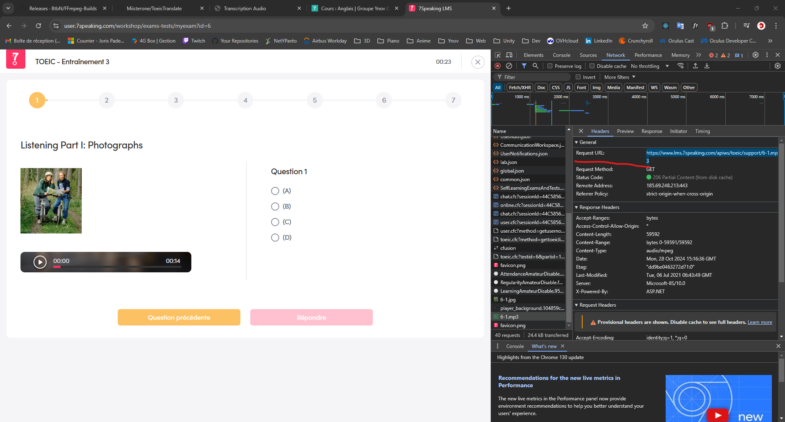
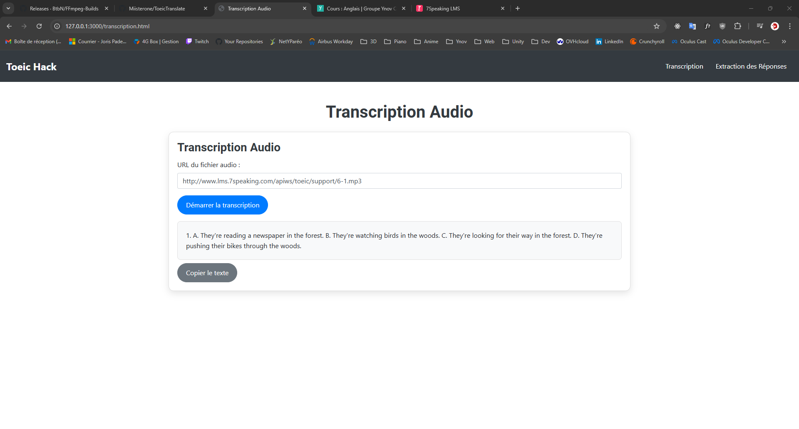

# Transcription et Extraction de Réponses TOEIC

Ce projet est une application web permettant de transcrire des fichiers audio et d'extraire les bonnes réponses d'un test TOEIC. Il utilise Node.js avec Express pour gérer le serveur et interagir avec un script Python pour la transcription audio.

## Fonctionnalités

- **Transcription Audio** : Saisissez l'URL d'un fichier audio et obtenez une transcription du fichier.
- **Extraction des Bonnes Réponses** : Saisissez l'URL d'une API TOEIC et extrayez automatiquement les bonnes réponses des questions.
- **Barre de Navigation** : Naviguez facilement entre la page de transcription et celle d'extraction des réponses.

## Installation

### 1. Cloner le dépôt :

```bash
git clone https://github.com/votre-repo.git
```

### 2. Utiliser Docker pour Exécuter l'Application

1. **Construire l'image Docker** :
   ```bash
   docker build -t transcription-app .
   ```

2. **Exécuter le conteneur Docker** :
   ```bash
   docker run -p 3000:3000 transcription-app
   ```

Accédez à l'application via [http://localhost:3000](http://localhost:3000).

## Utilisation

- **Transcription** : Allez sur la page `Transcription` via la barre de navigation, entrez l'URL d'un fichier audio et cliquez sur "Démarrer la transcription".
- **Extraction des réponses** : Allez sur la page `Extraction des réponses`, entrez l'URL d'une API TOEIC et cliquez sur "Extraire les bonnes réponses".

## Exemple Extraction Des Réponses

Récupérer l'url de la requete puis mettre l'url dans **`URL de l'API`** sur la page Extraction




## Exemple Transcription audio

Récupérer l'url de l'audio puis mettre l'url dans **`url du fichier audio`**



